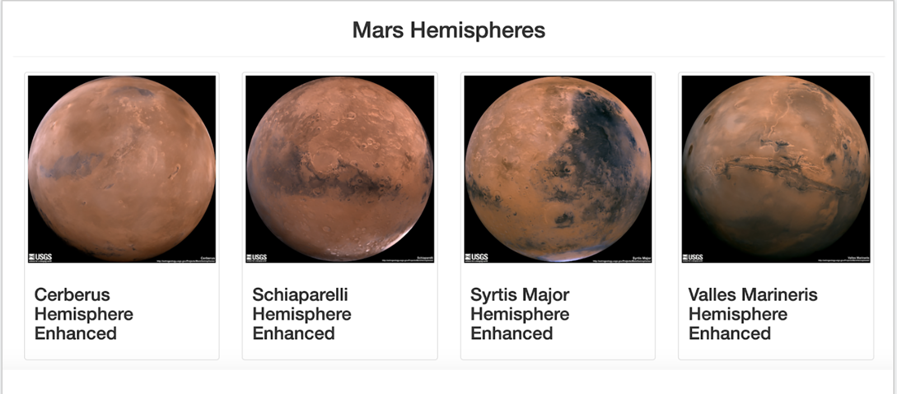

# Mission-to-Mars

## Background
In this project, I used BeautifulSoup and Splinter to scrape full-resolution images of Mars's hemispheres and their titles. Then ,I stored that data on a Mongo database and used Flask to display the data. Finally, I finalized the design of the website to accomodate all of the scraped data. 

### Deliverable 1
Scraped Full-Resolution Mars Hemisphere Images and Titles from NASA's website. 

### Deliverable 2
Updated the Flask Web App with the scraped Mars Hemisphere Images and Titles.

### Deliverable 3
Add Bootstrap 3 Components to finalize the design of the site. See image of the website below!

